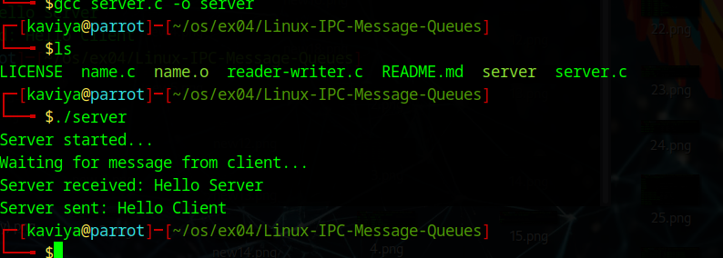
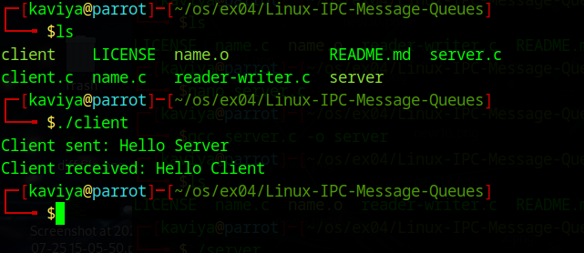

# Linux-IPC-Message-Queues
Linux IPC-Message Queues

# AIM:
To write a C program that receives a message from message queue and display them

# DESIGN STEPS:

### Step 1:

Navigate to any Linux environment installed on the system or installed inside a virtual environment like virtual box/vmware or online linux JSLinux (https://bellard.org/jslinux/vm.html?url=alpine-x86.cfg&mem=192) or docker.

### Step 2:

Write the C Program using Linux message queues API 

### Step 3:

Execute the C Program for the desired output. 

# PROGRAM:

## C program that receives a message from message queue and display them
## SERVER;
#include <stdio.h>
#include <stdlib.h>
#include <sys/ipc.h>
#include <sys/msg.h>
#include <string.h>

struct message
{
    long msg_type;
    char msg_text[100];
};

int main()
{
    key_t key;
    int msgid;
    struct message msg;

    // Generate a key
    key = ftok("server.c", 65);

    // Create message queue
    msgid = msgget(key, 0666 | IPC_CREAT);

    if (msgid == -1)
    {
        perror("msgget");
        exit(1);
    }

    printf("Server started...\n");
    printf("Waiting for message from client...\n");

    // Receive message
    if (msgrcv(msgid, &msg, sizeof(msg.msg_text), 1, 0) == -1)
    {
        perror("msgrcv");
        exit(1);
    }

    printf("Server received: %s\n", msg.msg_text);

    // Send reply
    msg.msg_type = 2;
    strcpy(msg.msg_text, "Hello Client");

    if (msgsnd(msgid, &msg, sizeof(msg.msg_text), 0) == -1)
    {
        perror("msgsnd");
        exit(1);
    }

    printf("Server sent: %s\n", msg.msg_text);

    // Delete message queue
    msgctl(msgid, IPC_RMID, NULL);

    return 0;
}
## CLIENT;

#include <stdio.h>
#include <stdlib.h>
#include <sys/ipc.h>
#include <sys/msg.h>
#include <string.h>

struct message
{
    long msg_type;
    char msg_text[100];
};

int main()
{
    key_t key;
    int msgid;
    struct message msg;

    // Generate the same key
    key = ftok("server.c", 65);

    // Access message queue
    msgid = msgget(key, 0666);

    if (msgid == -1)
    {
        perror("msgget");
        exit(1);
    }

    // Send message
    msg.msg_type = 1;
    strcpy(msg.msg_text, "Hello Server");

    msgsnd(msgid, &msg, sizeof(msg.msg_text), 0);

    printf("Client sent: %s\n", msg.msg_text);

    // Receive reply
    msgrcv(msgid, &msg, sizeof(msg.msg_text), 2, 0);

    printf("Client received: %s\n", msg.msg_text);

    return 0;
}

## OUTPUT

## server;

## client;

# RESULT:
The programs are executed successfully.
